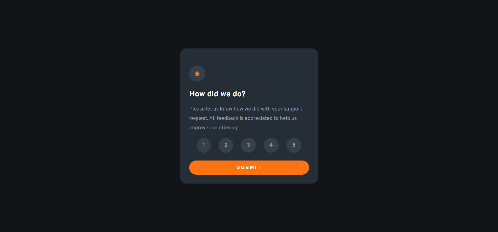

# Frontend Mentor - Interactive rating component solution

This is a solution to the [Interactive rating component challenge on Frontend Mentor](https://www.frontendmentor.io/challenges/interactive-rating-component-koxpeBUmI). Frontend Mentor challenges help you improve your coding skills by building realistic projects. 

## Table of contents

- [Frontend Mentor - Interactive rating component solution](#frontend-mentor---interactive-rating-component-solution)
  - [Table of contents](#table-of-contents)
  - [Overview](#overview)
    - [The challenge](#the-challenge)
    - [Screenshot](#screenshot)
    - [Links](#links)
  - [My process](#my-process)
    - [Built with](#built-with)
    - [What I learned](#what-i-learned)
    - [Continued development](#continued-development)
  - [Author](#author)

## Overview

Amazing challenge to train responsive design and DOM manipulation.

### The challenge

Users should be able to:

- View the optimal layout for the app depending on their device's screen size
- See hover states for all interactive elements on the page
- Select and submit a number rating
- See the "Thank you" card state after submitting a rating

### Screenshot

### Links

- Solution URL: [Add solution URL here](https://your-solution-url.com)
- Live Site URL: [Add live site URL here](https://your-live-site-url.com)

## My process

For me this second Frontend Mentor challenge was a bit more complex than the QR code component challenge not only because it had more elements to be manipulated through CSS, but also because of the DOM manipulation, which I definitely haven't mastered yet. But thanks to youtube I was able to access several examples of similar uses. 🙌

### Built with

- HTML5
- CSS
- Javascript
- Mobile-first workflow

### What I learned

This challenge helped me understand a little more about both CSS (responsive design - still not perfect!!) and DOM manipulation.

### Continued development

This challenge made me realize that, compared to a few weeks ago, I have managed to improve my CSS skills. But at the same time it made me realize how much I need to dedicate myself to evolve my javascript knowledge. 🤓

## Author

- Linkedin - [Nathália Esthevlana](https://www.linkedin.com/in/nathalia-esthevlana/)
- Frontend Mentor - [@esthevlana](https://www.frontendmentor.io/profile/esthevlana)

